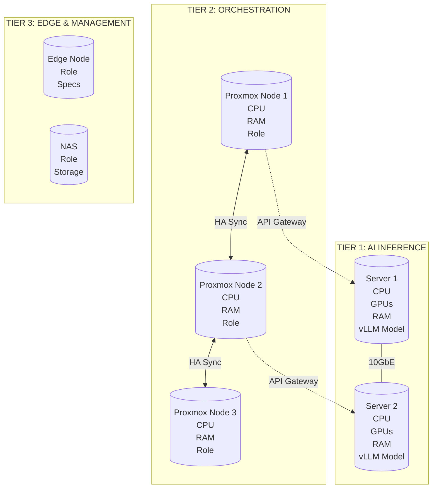
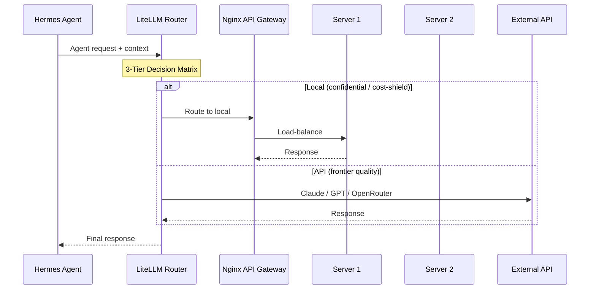
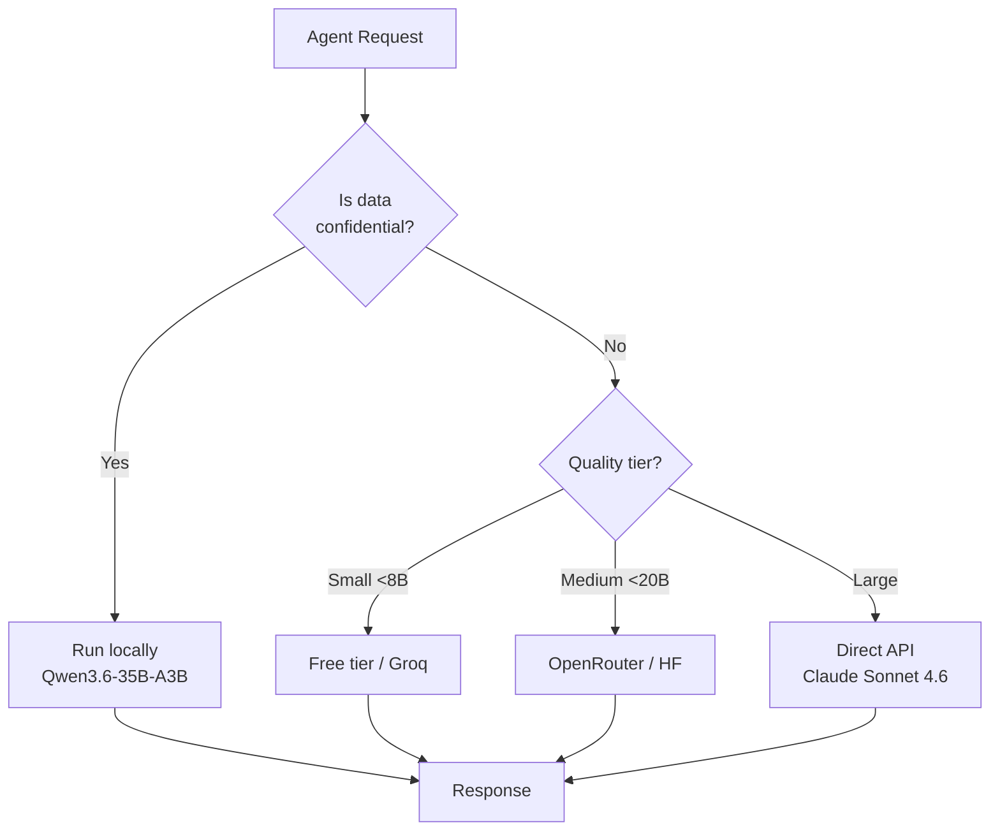
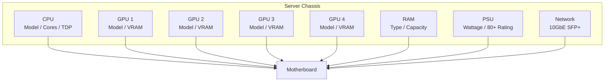
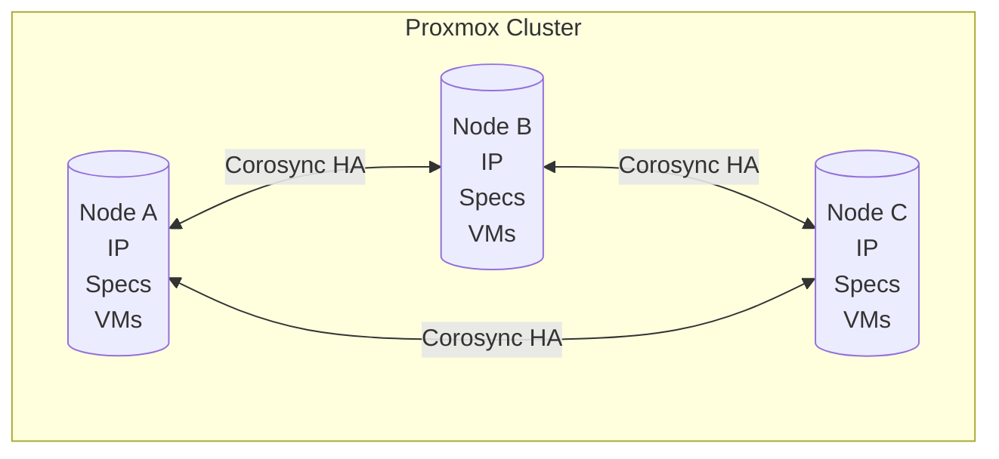
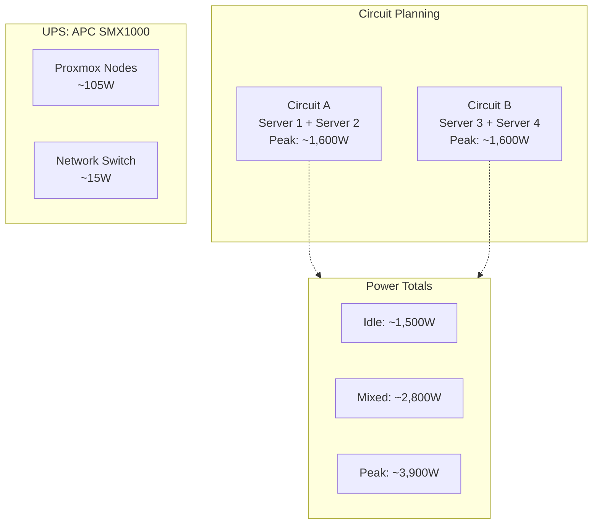

# <Project Name> — Server Architecture

> **Date:** YYYY-MM-DD  
> **Author:** <Your Name>  
> **Source:** <repo path to hardware research docs>

---

## ⚠️ CURRENT STATE: Conflict Detection

> [IF CONFLICTS EXIST: List every contradictory spec between docs]
> 
> | Doc | GPU Config | VRAM Total | RAM | Status |
> |-----|-----------|------------|-----|--------|
> | Doc A | ... | ... | ... |
> | Doc B | ... | ... | ... |
> 
> **Chosen configuration:** [Explain which plan wins and why]

---

## DIAGRAM 1: Full Cluster Overview



---

## DIAGRAM 2: Data Flow (Agent Request Lifecycle)



---

## DIAGRAM 3: Model Routing Decision Matrix



---

## DIAGRAM 4: Hardware Build Detail



---

## DIAGRAM 5: Proxmox Cluster Configuration



---

## DIAGRAM 6: Power Budget & Circuit Planning



---

## Critical Build Constraints

| # | Constraint | Impact | Mitigation |
|---|-----------|--------|------------|
| 1 | [Constraint name] | [What breaks] | [How to fix] |
| 2 | [Constraint name] | [What breaks] | [How to fix] |
| 3 | [Constraint name] | [What breaks] | [How to fix] |

---

## Build Priority Order

```mermaid
gantt
    title Build Timeline
    dateFormat YYYY-MM-DD
    section CRITICAL
    [Task name]       :crit, t1, YYYY-MM-DD, 5d
    section PRIORITY
    [Task name]       :t2, after t1, 10d
    section WAIT
    [Task name]       :t3, YYYY-MM-DD, 15d
```

---

## Architecture Change Log

| Date | Version | Changes |
|------|---------|---------|
| YYYY-MM-DD | v1.0 | Initial architecture |
